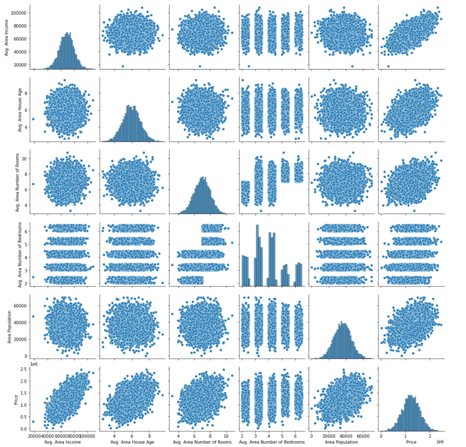
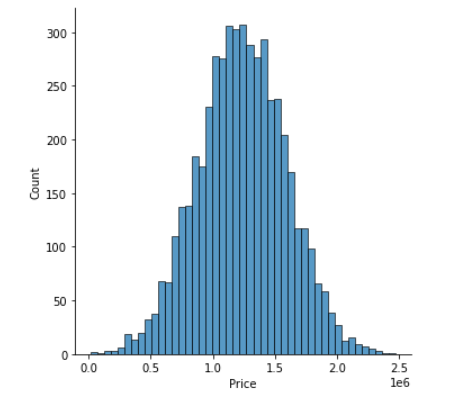
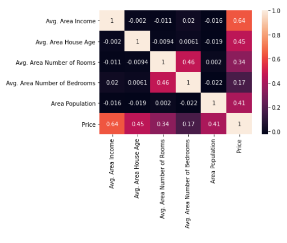
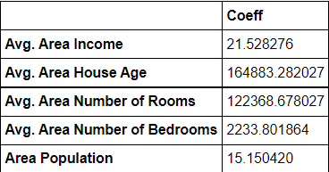
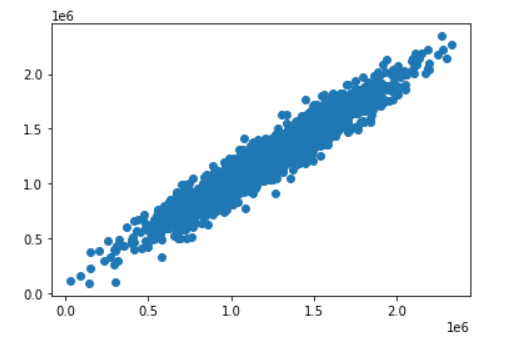
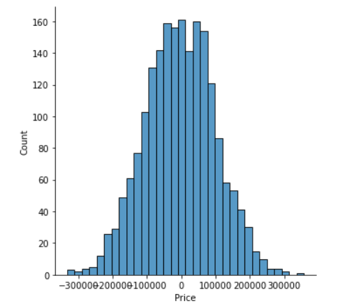

# House-Price-Prediction
Created a linear regression model to predict house prices based on existing features.

## Installation and Setup
```
git clone https://github.com/whoparthgarg/House-Price-Prediction
```

## Dataset
https://github.com/whoparthgarg/House-Price-Prediction/blob/main/USA_Housing.csv

## Exploratory Data Analysis
<center></center>
<center></center>
<center></center>

## Model Evaluation
<center></center>

## Predictions
<center></center>

## Residual Histogram
<center></center>

## Regression Evaluation Metrics
